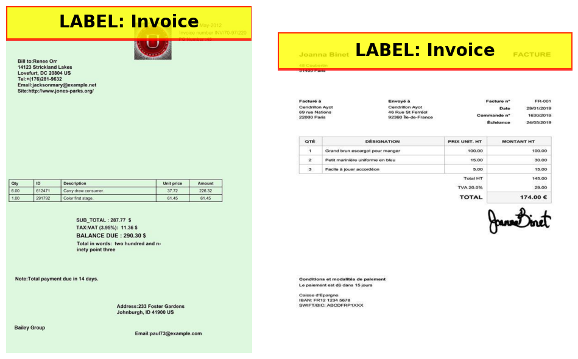
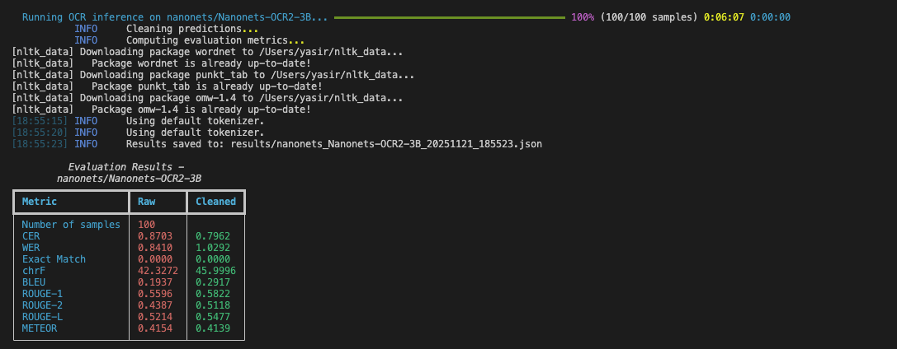
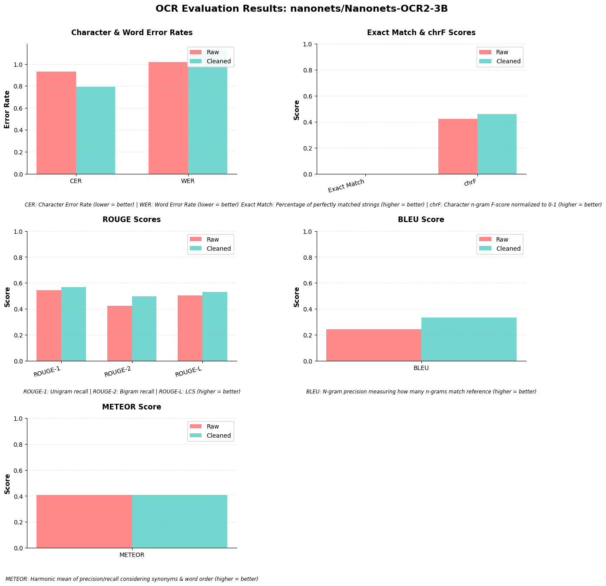
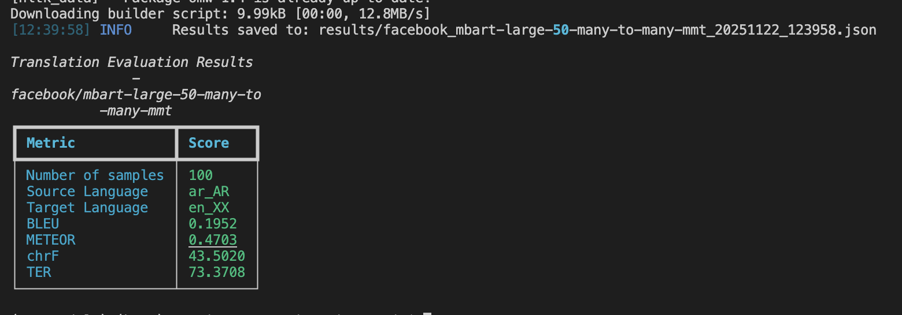
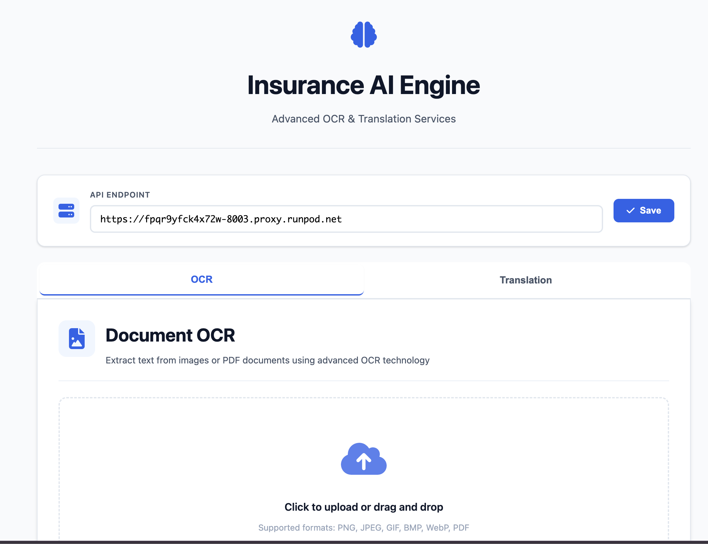

# Insurance AI Engine

OCR + translation engine for insurance documents with:
- Evaluation scripts for OCR and translation models
- A FastAPI backend that talks to OCR + translation models
- A simple web UI that uses the same backend endpoints

Two main workflows share this repo:
- **Evaluation** – run metrics against deployed models, save JSON results, compare runs
- **Serving** – run the API server and OCR model server used by the web UI and external clients

If you just want to run it locally, start with **[Quick Start (Local All‑in‑One)](#quick-start-local-all-in-one)**.  


---

## Quick Start (Local All‑in‑One)

This assumes a single machine with a GPU that can run both the OCR model and the FastAPI server.

### 1. Install dependencies

```bash
git clone <repository-url>
cd insurance_ai_engine
make setup-uv-and-sync
```

### 2. Start the OCR model server (GPU)

```bash
make ocr-serve-nanonets PORT=8002
```

Keep this terminal open; the model will listen on `http://localhost:8002`.

### 3. Configure environment for the backend

Create a `.env` file in the project root (or export these in your shell):

```bash
API_SERVER_URL=http://localhost:8000
NANONETS_NANONETS_OCR2_3B_URL=http://localhost:8002
OPENAI_API_KEY=DUMMY_API_KEY
```

You do not need `/v1` in the URL – it is added automatically.

### 4. Start the FastAPI backend

```bash
make start-api-server SERVER_PORT=8000
```

The backend exposes OCR + translation endpoints on `http://localhost:8000`.

### 5. Open the web interface

```bash
cd web
python -m http.server 8080
```

Then open `http://localhost:8080` in your browser and set the API endpoint to `http://localhost:8000`.

You now have:
- OCR model server on port **8002**
- API server on port **8000**
- Web UI on port **8080**

---

## Common Workflows

### Run OCR via API

```bash
curl -X POST "http://localhost:8000/ocr/infer" \
  -F "file=@image.jpg" \
  -F "model_name=nanonets/Nanonets-OCR2-3B"
```

For PDFs:

```bash
curl -X POST "http://localhost:8000/ocr/infer" \
  -F "file=@document.pdf" \
  -F "model_name=nanonets/Nanonets-OCR2-3B" \
  -F "pdf_dpi=200"
```

### Run translation via API

```bash
curl -X POST "http://localhost:8000/translation/translate" \
  -H "Content-Type: application/json" \
  -d '{
    "text": "Hello, how are you?",
    "src_lang": "en_XX",
    "target_lang": "ar_AR"
  }'
```

### Run OCR evaluation (metrics + JSON results)

```bash
# Uses models configured as active in src/config/models.yaml
make evaluate-ocr

# Or directly
uv run python -m src.scripts.evaluate
```

This will:
- Load the evaluation dataset from HuggingFace
- Call OCR models via API
- Compute metrics (CER, WER, BLEU, ROUGE, METEOR, etc.)
- Save JSON results to `results/`

For detailed explanations of metrics, datasets, and example JSON outputs, see **`docs/README.md`**.

## Assumptions and Prerequisites

Before using this repository, please ensure you understand and have access to the following:

### Assumptions

1. **GPU Infrastructure**: You have access to GPU servers (local or cloud) capable of running large language models (3B+ parameters)
2. **Model Deployment**: OCR models are deployed via vLLM with OpenAI-compatible APIs
3. **Network Access**: Your deployment environment allows HTTP/HTTPS API calls between components
4. **Python Environment**: Python 3.12+ is available with package management via `uv`
5. **HuggingFace Access**: For downloading evaluation datasets (if running evaluations) no account needed

### Prerequisites

**For Model Deployment:**
- GPU server with CUDA support (A100, RTX 4090, or similar)
- Python 3.12+
- [uv](https://github.com/astral-sh/uv) package manager
- Sufficient GPU memory (models require 3B+ parameters, ~8GB+ VRAM recommended)

**For API Server & Web Interface:**
- Python 3.12+
- Access to deployed OCR and translation models (local or remote)

**For Evaluation:**
- Python 3.12+
- Access to deployed model APIs
- HuggingFace access

---

## OCR and Translation Evaluation

This is the core functionality of the repository. The evaluation framework assesses OCR and translation model performance using standardized metrics.

### OCR Evaluation

The OCR evaluation framework assesses model performance on invoice images with structured layouts and tables.

#### Why Vision-Language Models for OCR?

Traditional OCR pipelines (Tesseract, PaddleOCR) struggle with:
- Complex layouts and multi-column documents
- Handwritten text mixed with printed text
- Table extraction and structured data
- Context-aware text recognition

**Vision-Language Models (VLMs) address these limitations by:**
- Understanding document structure through visual reasoning
- Extracting structured information (tables, forms) directly
- Handling diverse document types with a single model
- Providing natural language outputs that can be easily parsed

**Example Dataset Complexity:**



The evaluation dataset contains invoices with complex layouts, multi-column structures, and tabular data. These documents require models capable of:
- Extracting structured table data (itemized lists, quantities, prices)
- Preserving spatial relationships between text elements
- Handling multi-column layouts
- Recognizing document structure (headers, footers, tables, signatures)

#### OCR Evaluation Results

**Results Format:**

Each evaluation saves a JSON file to `results/` with pattern: `{model_name}_{timestamp}.json`

```json
{
  "model": "nanonets/Nanonets-OCR2-3B",
  "num_samples": 100,
  "timestamp": "2025-11-21T19:07:28.364252",
  "duration_seconds": 395.35,
  "duration_formatted": "6m 35s",
  "model_config": { ... },
  "dataset_info": { ... },
  "metrics": {
    "raw": {
      "cer": 0.87,
      "wer": 0.84,
      "chrf": { "score": 42.19 },
      "bleu": { "bleu": 0.19 },
      "rouge": { "rouge1": 0.56, "rouge2": 0.44, "rougeL": 0.52 },
      "meteor": { "meteor": 0.42 }
    },
    "cleaned": {
      "cer": 0.80,
      "wer": 1.03,
      "chrf": { "score": 45.84 },
      "bleu": { "bleu": 0.28 },
      "rouge": { "rouge1": 0.58, "rouge2": 0.51, "rougeL": 0.55 },
      "meteor": { "meteor": 0.41 }
    }
  },
  "samples": [ ... ]
}
```

**Visualization:**





#### OCR Evaluation Metrics

**Core OCR Metrics** (standard for OCR evaluation):
- **CER** (Character Error Rate): Primary OCR metric for character-level accuracy
- **WER** (Word Error Rate): Primary OCR metric for word-level accuracy
- **chrF** (Character n-gram F-score): Character-level similarity with order awareness
- **Exact Match**: Percentage of perfectly matched samples

**Generation Metrics** (for text generation quality assessment):
- **BLEU**: N-gram precision for text generation quality
- **ROUGE**: Recall-oriented metrics for text generation quality
- **METEOR**: Semantic similarity with synonym matching

| Metric | Type | Category | Description | Direction | Use Case |
|--------|------|----------|-------------|-----------|----------|
| **CER** | Character | Core OCR | Percentage of characters that differ between prediction and ground truth | Lower is better (0.0 = perfect) | Primary OCR metric for character-level accuracy |
| **WER** | Word | Core OCR | Percentage of words that differ between prediction and ground truth | Lower is better (0.0 = perfect) | Primary OCR metric for word-level accuracy |
| **chrF** | Character | Core OCR | Harmonic mean of character precision and recall using n-grams | Higher is better (0-100 scale) | Character-level similarity with order awareness |
| **Exact Match** | Word | Core OCR | Percentage of samples where entire prediction exactly matches ground truth | Higher is better (0.0-1.0) | Assessing perfect accuracy rate |
| **BLEU** | Sequence | Generation | Measures n-gram precision between prediction and reference | Higher is better (0.0-1.0) | Text generation quality assessment |
| **ROUGE-1/2/L** | Sequence | Generation | Recall-oriented metrics (unigram, bigram, LCS) | Higher is better (0.0-1.0) | Text generation quality assessment |
| **METEOR** | Sequence | Generation | Harmonic mean with synonym matching and word order | Higher is better (0.0-1.0) | Text generation quality assessment |

#### Evaluation Approach

The evaluation uses text-based metrics to assess model performance:

**Evaluation Methods:**

1. **Core OCR Metrics**: Standard OCR metrics (CER, WER, chrF, Exact Match) to measure content extraction accuracy
2. **Generation Metrics**: BLEU, ROUGE, METEOR to assess text generation quality
3. **Raw vs Cleaned Comparison**: Evaluates both raw and cleaned outputs for fair comparison
4. **Multiple Metrics**: Different metrics measure different aspects:
   - **Core OCR (Character-level)**: CER, chrF
   - **Core OCR (Word-level)**: WER, Exact Match
   - **Generation (Sequence-level)**: BLEU, ROUGE, METEOR

#### Reproducing Results (Running OCR Evaluation)

**Step 1: Setup**

```bash
git clone <repository-url>
cd insurance_ai_engine
make setup-uv-and-sync
```

**Step 2: Configure Model URL**

Point to your deployed backend API server:

```bash
# Option A: Use backend API (recommended)
export API_SERVER_URL="http://your-deployed-backend:8000"

# Option B: Call model directly
export NANONETS_NANONETS_OCR2_3B_URL="http://your-gpu-server:8002"
export OPENAI_API_KEY="DUMMY_API_KEY"
```

**Step 3: Run Evaluation**

```bash
# Run evaluation on all active OCR models
make evaluate-ocr

# Or run directly
uv run python -m src.scripts.evaluate
```

The evaluation script:
- Loads the dataset from HuggingFace
- Runs OCR inference via API calls to deployed models
- Computes metrics on raw and cleaned predictions
- Displays results in a table
- Saves JSON results to `results/` directory

#### OCR Dataset

The evaluation uses the `amaye15/invoices-google-ocr` dataset, which contains:
- **Images**: Invoice and document images (PNG format)
- **OCR Annotations**: Structured OCR data with bounding boxes and text
- **Labels**: Document type classification (Invoice, Receipt, Barcode, etc.)

#### Text Cleaning

The evaluation pipeline includes two cleaning functions:

**`clean_html_markdown()`**: Removes HTML tags and markdown syntax
- Strips `<table>`, `<tr>`, `<td>` tags
- Removes markdown headers, lists, code blocks
- Preserves text content

**`clean_ocr_text()`**: OCR text normalization
- Unicode normalization (smart quotes, dashes, etc.)
- Whitespace normalization
- Punctuation spacing fixes
- Zero-width character removal

This cleaning ensures fair comparison between models that output structured formats and plain text.

### Translation Evaluation

The evaluation framework also supports translation model evaluation using standard machine translation metrics.

#### Why mBART?

**Architecture Choice:**
mBART uses a sequence-to-sequence transformer architecture with language-specific tokens. Unlike traditional translation models that require separate models for each language pair, mBART uses a single model with language code prefixes (e.g., `ar_AR`, `en_XX`) to handle all language pairs.

#### Translation Evaluation Results

Translation evaluation results are saved in JSON format similar to OCR evaluation. Example results from mBART model evaluation:

```json
{
  "model": "facebook/mbart-large-50-many-to-many-mmt",
  "model_type": "mbart",
  "num_samples": 100,
  "model_config": {
    "name": "facebook/mbart-large-50-many-to-many-mmt",
    "type": "mbart",
    "src_lang": "ar_AR",
    "target_lang": "en_XX",
    "max_workers": 3
  },
  "dataset_info": {
    "dataset_name": "Helsinki-NLP/opus-100",
    "split": "test",
    "num_samples": 100
  },
  "metrics": {
    "bleu": {
      "bleu": 0.1952
    },
    "meteor": {
      "meteor": 0.4703
    },
    "chrf": {
      "score": 43.5020
    },
    "ter": {
      "score": 73.3708
    }
  },
  "samples": [ ... ]
}
```

**Visualization:**



#### Translation Metrics

Translation evaluation uses metrics designed for machine translation quality assessment:

**Interpreting Translation Metrics:**

- **BLEU**: Focuses on precision - how many n-grams from the translation match the reference. Low scores may indicate poor quality or empty outputs.
- **METEOR**: Balances precision and recall with synonym awareness. Often correlates better with human judgment than BLEU.
- **chrF**: Character-level evaluation useful for morphologically rich languages or different writing systems.
- **TER**: Measures word-level errors - the minimum edits needed to match the reference. Lower scores indicate fewer errors.

| Metric | Type | Description | Direction | Use Case |
|--------|------|-------------|-----------|----------|
| **BLEU** | Sequence | Measures n-gram precision (1-4 grams) between translation and reference. Includes brevity penalty for short translations | Higher is better (0.0-1.0) | Primary translation quality metric, widely used in MT evaluation |
| **METEOR** | Sequence | Harmonic mean of precision and recall with synonym matching. Considers word order and semantic similarity | Higher is better (0.0-1.0) | Better correlation with human judgment than BLEU, handles synonyms |
| **chrF** | Character | Character-level F-score measuring character n-gram overlap. Less affected by word segmentation differences | Higher is better (0-100 scale) | Useful for languages with different writing systems or word boundaries |
| **TER** | Sequence | Translation Error Rate - measures the minimum number of edits (insertions, deletions, substitutions, shifts) needed to transform translation into reference | Lower is better (0-100 scale, 0 = perfect) | Word-level error rate assessment, complementary to BLEU |

#### Translation Dataset

Translation evaluation uses the `Helsinki-NLP/opus-100` dataset, which contains:
- Parallel text pairs in multiple languages
- High-quality human translations
- Various domains (news, legal, conversational, etc.)
- Language pairs: Arabic-English (ar-en), Czech-English (cs-en), and others

#### Reproducing Results (Running Translation Evaluation)

**Note:** mBART models run locally in the FastAPI server process using the transformers library. They are loaded when the API server starts, not as a separate service.

```bash
# Set environment variables (only needed for OCR models)
export NANONETS_NANONETS_OCR2_3B_URL="http://localhost:8002"
export OPENAI_API_KEY="DUMMY_API_KEY"

# Start API server (mBART model loads automatically)
make start-api-server SERVER_PORT=8000

# Run translation evaluation (in another terminal)
make evaluate-translation
```

The translation evaluation:
- Loads parallel text pairs from the dataset
- Calls the translation API endpoint (mBART runs in the same server process)
- Computes BLEU, METEOR, chrF, and TER metrics
- Saves results to JSON files in `results/` directory

#### OCR Evaluation Limitations and Future Enhancements

**Current Limitations:**

- Text-based evaluation only (no spatial/structural assessment)
- Limited to English language evaluation
- No visual quality assessment (image quality, preprocessing effects)
- No real-time performance metrics (latency, throughput)

**Future Enhancements:**

- Spatial evaluation metrics (bounding box accuracy, layout preservation)
- Multi-language evaluation support
- Visual quality assessment
- Performance benchmarking (latency, throughput, cost)
- Interactive evaluation dashboard

---

## Overview

This repository keeps **evaluation**, **deployment**, and **serving** in one place so you can test exactly what the API returns.

- **Main pieces:**
  - Evaluation code for OCR and translation (metrics, datasets, JSON results, and plots)
  - A FastAPI backend and vLLM OCR server (often on a RunPod L40 GPU)
  - A simple web page that calls the same backend endpoints used in evaluation

For details on metrics and model choices, see **[OCR and Translation Evaluation](#ocr-and-translation-evaluation)**.  
For a step-by-step setup to run this locally or on a GPU server, see **[Reproducing This Setup (Quick Start)](#reproducing-this-setup-quick-start)**.

---

## Reproducing This Setup (Quick Start)

Follow these simple steps to get the system running:

### 1. Install Dependencies

```bash
git clone <repository-url>
cd insurance_ai_engine
make setup-uv-and-sync
```

### 2. Deploy OCR Model (on GPU server)

```bash
# Start the OCR model server (requires GPU)
make ocr-serve-nanonets PORT=8002
```

**Note:** The model runs on port 8002 by default. Keep this terminal open.

### 3. Configure Environment

Create a `.env` file in the project root:

```bash
# For backend API mode (recommended)
API_SERVER_URL=http://localhost:8000

# For direct model access (alternative)
# NANONETS_NANONETS_OCR2_3B_URL=http://localhost:8002
# OPENAI_API_KEY=DUMMY_API_KEY
```

**Tip:** URLs without `/v1` work fine - it's added automatically.

### 4. Start Backend API Server

```bash
# Set model URL (backend needs it to call models)
export NANONETS_NANONETS_OCR2_3B_URL="http://localhost:8002"
export OPENAI_API_KEY="DUMMY_API_KEY"

# Start the API server
make start-api-server SERVER_PORT=8000
```

**Note:** The mBART translation model loads automatically when the server starts.

### 5. Access the Web Interface

Open `web/index.html` in your browser, or serve it with:

```bash
cd web
python3 -m http.server 8080
```

Then visit `http://localhost:8080` and enter your API server URL (e.g., `http://localhost:8000`).

### That's It!

You now have:
- OCR model server running on port 8002 (vLLM server)
- Backend API server running on port 8000 (FastAPI server)
- Translation model loaded in the API server (mBART)
- Web interface ready to use (client-side HTML/JS)

**For evaluation**, see the [OCR and Translation Evaluation](#ocr-and-translation-evaluation) section.

**For production deployment**, see the [Deployment](#deployment) section.

---

## OCR System

The OCR system uses vision-language models to extract text from documents.

### Supported Models

**nanonets/Nanonets-OCR2-3B**
- 3B parameter vision-language model optimized for document OCR
- Capable of extracting text from complex layouts including tables
- Outputs structured formats (HTML tables, markdown) when appropriate
- Currently active and evaluated

**rednote-hilab/dots.ocr**
- Specialized OCR model for document processing
- Designed for structured document extraction
- Currently configured but inactive (can be activated for comparison)

### Model Selection Criteria

- **Layout Awareness**: Handle documents with tables and structured layouts
- **Text Extraction Quality**: Accurate text extraction for downstream processing
- **API Compatibility**: Deployable via vLLM with OpenAI-compatible API
- **Production Readiness**: Suitable for production with reasonable inference speed

### OCR Capabilities

- **Document Types**: Images (PNG, JPEG, GIF, BMP, WebP) and PDF files
- **Output Formats**: Plain text, HTML tables, Markdown
- **Batch Processing**: Process multiple documents in parallel
- **Structured Extraction**: Automatically extracts tables and structured data

---

## Translation System

The translation system provides multilingual text translation using mBART models.

### Supported Model

**facebook/mbart-large-50-many-to-many-mmt**
- Large multilingual translation model (611M parameters)
- Supports 50+ languages with proper language code prefixes
- Many-to-many translation architecture (any language to any language)

---

## System Architecture

The system follows a client-server architecture with three main components:

### Server-Side Components (Backend)

**1. OCR Model Server (vLLM)**
- **What:** Vision-language model serving OCR inference
- **Technology:** vLLM with OpenAI-compatible API
- **Model:** nanonets/Nanonets-OCR2-3B
- **Port:** 8002 (default)
- **Protocol:** HTTP REST API
- **Deployment:** Runs on GPU server (local or RunPod.io)

**2. Backend API Server (FastAPI)**
- **What:** Unified API gateway for OCR and translation services
- **Technology:** FastAPI (Python)
- **Port:** 8000 (default)
- **Endpoints:** `/ocr/infer-base64`, `/translation/translate`, etc.
- **Responsibilities:**
  - Receives requests from clients (web interface, evaluation scripts)
  - Calls OCR model server for OCR tasks
  - Runs mBART translation model locally (loaded in server process)
  - Returns formatted responses to clients
- **Deployment:** Can run on same server as OCR model or separately

**3. Translation Model (mBART)**
- **What:** Multilingual translation model
- **Technology:** Transformers library (HuggingFace)
- **Model:** facebook/mbart-large-50-many-to-many-mmt
- **Deployment:** Loaded directly into FastAPI server process (not a separate service)
- **Note:** No separate URL needed - runs locally in API server

### Client-Side Components

**1. Web Interface**
- **What:** Browser-based UI for testing and demonstration
- **Technology:** HTML, CSS, JavaScript (vanilla JS, no framework)
- **Files:** `web/index.html`, `web/app.js`, `web/styles.css`
- **Functionality:**
  - Upload images/PDFs for OCR
  - Enter text for translation
  - Display results with markdown rendering
- **Deployment:** Static files served via HTTP server or opened directly in browser
- **Communication:** Makes HTTP requests to Backend API Server

**2. Evaluation Scripts**
- **What:** Python scripts for model evaluation
- **Technology:** Python with HuggingFace datasets, evaluation metrics
- **Files:** `src/scripts/evaluate.py`, `src/evaluation/evaluator.py`
- **Functionality:**
  - Load evaluation datasets
  - Run batch inference via API calls
  - Compute metrics (CER, WER, BLEU, etc.)
  - Save results to JSON files
- **Deployment:** Runs on local machine or evaluation server
- **Communication:** Makes HTTP requests to Backend API Server or directly to OCR Model Server

### Deployment Architecture

```
┌─────────────────────────────────────────────────────────────────┐
│              Server-Side (RunPod.io Cloud - L40 GPU)            │
│                    Cost: $1.00/hour                             │
│  ┌───────────────────────────────────────────────────────────┐  │
│  │  OCR Model Server (vLLM)                                  │  │
│  │  - Port: 8002                                              │  │
│  │  - Endpoint: http://localhost:8002/v1                     │  │
│  │  - Protocol: OpenAI-compatible API                        │  │
│  └───────────────────────────────────────────────────────────┘  │
│  ┌───────────────────────────────────────────────────────────┐  │
│  │  Backend API Server (FastAPI)                             │  │
│  │  - Port: 8000                                              │  │
│  │  - Endpoint: http://localhost:8000                        │  │
│  │  - Contains: mBART translation model (loaded in process) │  │
│  │  - Proxy URL: *.proxy.runpod.net (for external access)   │  │
│  └───────────────────────────────────────────────────────────┘  │
└─────────────────────────────────────────────────────────────────┘
                            ▲
                            │ HTTPS/HTTP
                            │
┌───────────────────────────┼───────────────────────────────────┐
│                    Client-Side Components                       │
│  ┌──────────────────────────────────────────────────────────┐ │
│  │  Web Interface (Browser)                                  │ │
│  │  - Static HTML/JS files                                   │ │
│  │  - Makes API calls to Backend API Server                 │ │
│  └──────────────────────────────────────────────────────────┘ │
│  ┌──────────────────────────────────────────────────────────┐ │
│  │  Evaluation Scripts (Python)                             │ │
│  │  - Runs on local machine or evaluation server            │ │
│  │  - Makes API calls to Backend API Server                 │ │
│  │  - Or calls OCR Model Server directly                    │ │
│  └──────────────────────────────────────────────────────────┘ │
└─────────────────────────────────────────────────────────────────┘
```

### Communication Flow

**Web Interface → Backend API Server:**
1. User uploads document or enters text in web interface
2. Web interface sends HTTP POST request to Backend API Server
3. Backend API Server processes request:
   - For OCR: Calls OCR Model Server, returns text
   - For Translation: Uses local mBART model, returns translation
4. Web interface displays results

**Evaluation Scripts → Backend API Server:**
1. Evaluation script loads dataset
2. For each sample, sends HTTP request to Backend API Server
3. Backend API Server processes and returns result
4. Evaluation script computes metrics and saves results

**Backend API Server → OCR Model Server:**
1. Backend API Server receives OCR request
2. Calls OCR Model Server via OpenAI-compatible API
3. OCR Model Server returns extracted text
4. Backend API Server formats and returns to client

### Key Architecture Decisions

1. **Separation of Concerns**: Model serving, API server, and evaluation are separate components
2. **Cloud Deployment**: Backend deployed on RunPod.io for GPU access or any server with GPU
---

## Components

### Backend API Server

**Location:** `server/main.py`

**Purpose:** Central API gateway that handles all client requests and coordinates with model servers.

**Responsibilities:**
- Receives HTTP requests from clients (web interface, evaluation scripts)
- Routes OCR requests to OCR Model Server (vLLM)
- Handles translation requests using local mBART model
- Formats and returns responses to clients
- Manages CORS for web interface access

**Endpoints:**

**Health & Information:**
- `GET /` - API information and active models
- `GET /health` - Health check
- `GET /models` - List all active OCR and translation models

**OCR Endpoints:**
- `POST /ocr/infer` - Single image/PDF inference (file upload)
- `POST /ocr/infer-base64` - Base64 encoded image inference
- `POST /ocr/batch` - Batch inference (multiple files)

**Translation Endpoints:**
- `POST /translation/translate` - Single text translation
- `POST /translation/batch` - Batch text translation

**Running the Backend API Server:**

```bash
# Start API server (default port 8000)
make start-api-server SERVER_PORT=8000

# The server needs model URLs to call OCR models:
export NANONETS_NANONETS_OCR2_3B_URL="http://localhost:8002"
export OPENAI_API_KEY="DUMMY_API_KEY"
```

**Note:** The mBART translation model loads automatically when the server starts - no separate service needed.

See `server/README.md` for detailed API documentation.

### Web Interface (Client)

**Location:** `web/` directory

**Purpose:** Browser-based client application for testing OCR and translation capabilities.

**Technology:**
- Static HTML/CSS/JavaScript files
- No backend framework required
- Uses Fetch API for HTTP requests
- Marked.js library for markdown rendering

**Components:**
- `index.html` - Main HTML structure
- `app.js` - Client-side logic for API calls and UI interactions
- `styles.css` - Styling and layout

**How it works:**
1. User opens `web/index.html` in browser (or via HTTP server)
2. User enters Backend API Server URL (e.g., `http://localhost:8000`)
3. User uploads document or enters text
4. JavaScript makes HTTP request to Backend API Server
5. Results are displayed with markdown rendering



#### Demo capabilities

- **Document OCR**: Upload images or PDF files to extract text
- **Text Translation**: Translate text between supported languages
- **Markdown Rendering**: Properly renders markdown and HTML content in OCR results (including tables)

#### Using the Web Interface

**Option 1: Open directly in browser**


**Option 2: Serve with a local server**

```bash
# Using Python
cd web
python -m http.server 8080
```

Then open `http://localhost:8080` in your browser.

**Configuration:**

The API server URL defaults to RunPod proxy endpoint but can be changed:
1. **Via UI**: Enter the URL in the "API Endpoint" field and click "Save"
2. **Via localStorage**: The URL is saved in browser localStorage for persistence

**For Local Development:**

If running the API server locally, update the API endpoint to:
- `http://localhost:8000` (default FastAPI port)
- Or your custom port if configured differently

---

## Deployment

### Deployment Architecture: RunPod.io

The backend API server and OCR models are deployed on [RunPod.io](https://www.runpod.io/), a cloud GPU platform.

#### Current Testing Deployment Setup

**GPU Instance:**
- **GPU Type**: NVIDIA L40 GPU
- **Cost**: $1.00 per hour (pay-per-use)
- **Hosting**: Both the FastAPI backend server and OCR/translation models run on the same L40 GPU instance


### Local Deployment

For local development or testing:

#### Step 1: Clone and Setup

```bash
git clone <repository-url>
cd insurance_ai_engine
make setup-uv-and-sync
```

#### Step 2: Deploy OCR Model Server

```bash
# Deploy Nanonets OCR2 3B model (default port 8002)
make ocr-serve-nanonets [PORT=8002]

# Deploy Dots OCR model
make ocr-serve-dots [PORT=8002]

# Stop all vLLM servers
make stop
```

#### Step 3: Verify Deployment

```bash
# Check health
curl http://localhost:8002/health

# List models
curl http://localhost:8002/v1/models
```

#### Step 4: Start API Server

```bash
# Set environment variables for the API server (it needs model URLs internally)
export NANONETS_NANONETS_OCR2_3B_URL="http://localhost:8002"
export OPENAI_API_KEY="DUMMY_API_KEY"

# Start API server (mBART translation model loads automatically in the server process)
make start-api-server SERVER_PORT=8000

# For evaluation, set API_SERVER_URL to point to the backend
export API_SERVER_URL="http://localhost:8000"
```

### Production Considerations

- **GPU Memory**: Adjust `--gpu-memory-utilization` based on available VRAM
- **Concurrency**: Tune `--max-num-seqs` and `--max-num-batched-tokens` for your workload
- **Prefix Caching**: Enabled by default for better performance with repeated prompts
- **Process Management**: Consider using systemd or supervisor for production deployments
- **Load Balancing**: Use multiple API server instances behind a load balancer

---

## Configuration

### Model Configuration

Model configuration is managed through `src/config/models.yaml`. Each model entry includes:

**OCR Models:**
- `name`: Model identifier (e.g., `nanonets/Nanonets-OCR2-3B`)
- `prompt`: Instruction prompt for the OCR task
- `batch_size`: Number of samples processed per batch during evaluation
- `max_workers`: Maximum parallel API calls for batch inference
- `num_samples`: Number of samples to evaluate (optional)
- `active`: Whether the model is active (only active models are loaded)
- `save_results`: Whether to save evaluation results to JSON
- `results_dir`: Directory for saving results
- `use_backend_api`: Whether to use backend API server or call model directly
  - `true`: Use FastAPI backend endpoint `/ocr/infer-base64` (like web interface)
  - `false`: Call model directly via OpenAI-compatible API (faster, no backend needed)
  - `null`: Use `USE_BACKEND_API` environment variable or default to `false`
- `url`: Optional explicit API URL for direct model access (only needed if `use_backend_api=false`)
  - **Note:** If not set, the system looks for `{MODEL_NAME}_URL` environment variable
  - The `/v1` endpoint path is automatically appended if not present (for vLLM compatibility)

**Translation Models:**
- `name`: Model identifier (e.g., `facebook/mbart-large-50-many-to-many-mmt`)
- `type`: Model type (`mbart` or `llm`)
- `model_path`: HuggingFace model path for mBART (e.g., `facebook/mbart-large-50-many-to-many-mmt`) or API URL for LLM
- `src_lang`: Default source language code (e.g., `ar_AR`, `en_XX`)
- `target_lang`: Default target language code (e.g., `en_XX`, `ar_AR`)
- `max_workers`: Maximum parallel workers for batch translation
- `active`: Whether the model is active

**Important:** mBART models (`type: mbart`) run locally in the FastAPI server process using the transformers library. They are loaded when the server starts - no separate service or URL configuration needed. LLM-based translation models (`type: llm`) require an API URL.

### Environment Variables

**Quick Summary:**
- Model URLs automatically get `/v1` appended (you can include it or not)
- Configure `use_backend_api` in `src/config/models.yaml` (recommended)
- Or use environment variables as fallback

**Key Variables:**

| Variable | Purpose | Example |
|----------|---------|---------|
| `API_SERVER_URL` | Backend API server URL | `http://localhost:8000` |
| `{MODEL_NAME}_URL` | Direct model access URL | `NANONETS_NANONETS_OCR2_3B_URL=http://localhost:8002` |
| `OPENAI_API_KEY` | API key (use `DUMMY_API_KEY` for local) | `DUMMY_API_KEY` |
| `USE_BACKEND_API` | Use backend API or direct access | `true` or `false` |

**Configuration Priority:**
1. YAML config (`src/config/models.yaml`) - **Recommended**
2. Environment variables (`.env` file or shell exports)
3. Defaults (direct model access)

**Example `.env` file:**

```bash
# Backend API mode (recommended)
API_SERVER_URL=http://localhost:8000

# Direct model access (alternative)
# NANONETS_NANONETS_OCR2_3B_URL=http://localhost:8002
# OPENAI_API_KEY=DUMMY_API_KEY
```

**Note:** mBART translation models run locally in the API server - no URL needed.

**Important Notes:**
- **YAML Configuration (Recommended)**: Set `use_backend_api` in `src/config/models.yaml` for each model
  - Priority order: YAML config (`use_backend_api` field) → Environment variable (`USE_BACKEND_API`) → Default (`false`)
- `API_SERVER_URL` should point to your FastAPI backend server (default: `http://localhost:8000`)
- When `use_backend_api=true`: OCR inference calls the backend API endpoint `/ocr/infer-base64` (like web interface)
- When `use_backend_api=false`: OCR inference calls models directly via OpenAI-compatible API (faster, no backend needed)
- The backend server handles model communication internally when using backend API mode
- For RunPod deployments, use the proxy URL: `https://your-pod-id-8003.proxy.runpod.net`

---

## Usage Guide

### Quick Start: Complete Local Setup

1. **Start OCR Model Server** (Terminal 1):
   ```bash
   make ocr-serve-nanonets PORT=8002
   ```

2. **Set Environment Variables** (Terminal 2):
   ```bash
   export NANONETS_NANONETS_OCR2_3B_URL="http://localhost:8002"
   export OPENAI_API_KEY="DUMMY_API_KEY"
   # Note: mBART translation model runs locally in the API server - no URL needed
   ```

3. **Start API Server** (Terminal 2):
   ```bash
   make start-api-server SERVER_PORT=8000
   ```

4. **Open Web Interface**:
   ```bash
   cd web
   python -m http.server 8080
   ```
   Then open `http://localhost:8080` in your browser.

### Using OCR via API

**Single Image Inference:**

```bash
curl -X POST "http://localhost:8000/ocr/infer" \
  -F "file=@image.jpg" \
  -F "model_name=nanonets/Nanonets-OCR2-3B"
```

**PDF Document Inference:**

```bash
curl -X POST "http://localhost:8000/ocr/infer" \
  -F "file=@document.pdf" \
  -F "model_name=nanonets/Nanonets-OCR2-3B" \
  -F "pdf_dpi=200"
```

**Base64 Image Inference:**

```bash
curl -X POST "http://localhost:8000/ocr/infer-base64" \
  -H "Content-Type: application/json" \
  -d '{
    "image_base64": "base64_encoded_image_string",
    "model_name": "nanonets/Nanonets-OCR2-3B"
  }'
```

### Using Translation via API

**Single Text Translation:**

```bash
curl -X POST "http://localhost:8000/translation/translate" \
  -H "Content-Type: application/json" \
  -d '{
    "text": "Hello, how are you?",
    "src_lang": "en_XX",
    "target_lang": "ar_AR"
  }'
```

**Batch Translation:**

```bash
curl -X POST "http://localhost:8000/translation/batch" \
  -H "Content-Type: application/json" \
  -d '{
    "texts": ["Hello", "World"],
    "src_lang": "en_XX",
    "target_lang": "ar_AR"
  }'
```

### Using the Web Interface

1. **Open the web interface** (see [Web Interface](#web-interface) section)
2. **Configure API Endpoint** (if not using default RunPod URL)
3. **For OCR**:
   - Click on "OCR" tab
   - Upload an image or PDF file
   - Click "Process OCR"
   - View results with rendered markdown/HTML
4. **For Translation**:
   - Click on "Translation" tab
   - Enter source text
   - Select source and target languages (required)
   - Click "Translate"
   - View translation results

---

## Development

### Project Structure

```
insurance_ai_engine/
├── src/
│   ├── config/           # Configuration loading (models.yaml)
│   ├── evaluation/       # Evaluation metrics and logic
│   ├── inference/        # OCR and translation inference via API
│   │   ├── ocr.py        # OCR inference logic
│   │   └── translation.py # Translation inference logic
│   ├── models/           # Model configuration models
│   ├── scripts/          # Evaluation scripts
│   │   ├── evaluate.py   # Main evaluation script
│   │   └── data_loader.py # Dataset loading utilities
│   └── utils.py          # Utility functions (image encoding, text cleaning)
├── server/               # FastAPI server for OCR and Translation API
│   ├── main.py          # API server implementation
│   └── README.md        # API documentation
├── web/                  # Web interface
│   ├── index.html       # Main HTML file
│   ├── styles.css       # Styling
│   └── app.js           # JavaScript logic
├── notebooks/           # Jupyter notebooks for experimentation
│   └── 01_experminets.ipynb # Evaluation experiments and visualizations
├── results/             # Evaluation results (JSON files)
├── data/                # Dataset cache directory
├── docs/                # Documentation and images
├── makefile             # Deployment and utility commands
└── pyproject.toml       # Python dependencies
```

### Adding a New OCR Model

1. **Add model configuration to `src/config/models.yaml`:**

```yaml
ocr_models:
  - name: your-model/name
    prompt: "Your OCR prompt"
    batch_size: 10
    max_workers: 3
    num_samples: 100
    active: true
    save_results: true
    results_dir: results
```

2. **Add deployment command to `makefile`:**

```makefile
ocr-serve-your-model:
    uv run vllm serve your-model/name --host 0.0.0.0 --port $(PORT) ...
```

3. **Set environment variable for model URL:**

```bash
export YOUR_MODEL_NAME_URL="http://localhost:8002/v1"
```

### Adding a New Translation Model

1. **Add model configuration to `src/config/models.yaml`:**

```yaml
translation_models:
  - name: your-translation-model
    type: mbart  # or "llm"
    model_path: "path/to/model"  # or URL for LLM
    src_lang: "en_XX"
    target_lang: "ar_AR"
    max_workers: 4
    active: true
```

2. **Update translation inference code** if needed (for custom model types)

### Available Makefile Commands

View all available commands:

```bash
make help
```

**Common commands:**
- `make setup-uv-and-sync` - Setup uv and install dependencies
- `make ocr-serve-nanonets` - Deploy Nanonets OCR model
- `make ocr-serve-dots` - Deploy Dots OCR model
- `make start-api-server` - Start FastAPI server
- `make evaluate-ocr` - Run OCR evaluation on active OCR models
- `make evaluate-translation` - Run translation evaluation on active translation models
- `make stop` - Stop all vLLM servers
- `make clean` - Clean project artifacts

### Programmatic Usage

**OCR Evaluation:**

```python
from datasets import load_dataset
from src.config import load_config
from src.evaluation import evaluate_dataset

# Load configuration
config = load_config()

# Load dataset
dataset = load_dataset("amaye15/invoices-google-ocr", split="test")

# Run evaluation
results = evaluate_dataset(
    dataset=dataset,
    model_config=config.ocr_models[0],
    num_samples=100,
    dataset_name="amaye15/invoices-google-ocr",
    dataset_split="test"
)

# Access metrics
print(f"CER (cleaned): {results['metrics']['cleaned']['cer']}")
print(f"WER (cleaned): {results['metrics']['cleaned']['wer']}")
```

**OCR Inference:**

```python
from src.inference.ocr import infer
from src.config import load_config

config = load_config()
model_config = config.ocr_models[0]

# Encode image to base64
from src.utils import encode_image
from PIL import Image

image = Image.open("document.jpg")
img_base64 = encode_image(image)

# Run inference
result = infer(img_base64, model_config)
print(result)
```

**Translation:**

```python
from src.inference.translation import infer as translate
from src.config import load_config

config = load_config()
model_config = config.translation_models[0]

# Translate text
result = translate(
    "Hello, how are you?",
    model_config,
    src_lang="en_XX",
    target_lang="ar_AR"
)
print(result)
```

### Notebook Experiments

The `notebooks/01_experminets.ipynb` notebook contains:
- Dataset exploration and analysis
- Custom evaluation runs
- Visualization code for generating comparison charts
- Experimentation with different model configurations

Use this notebook as a reference for custom evaluations and visualizations.

---

## Troubleshooting

### Model Server Not Starting

**Symptoms:** vLLM server fails to start or crashes

**Solutions:**
- Check GPU availability: `nvidia-smi`
- Verify CUDA installation: `nvcc --version`
- Check port availability: `lsof -i :8002`
- Review vLLM logs for memory errors
- Reduce `--gpu-memory-utilization` if out of memory

### API Server Connection Issues

**Symptoms:** API server can't connect to OCR/translation models

**Solutions:**
- Verify model URLs are correct: `curl $MODEL_URL/health`
- Check environment variables are set: `env | grep URL`
- Ensure models are running and accessible
- Check firewall/network settings
- Verify API keys if using cloud services

### Evaluation Failing

**Symptoms:** Evaluation script errors or hangs

**Solutions:**
- Verify model URL is accessible: `curl $MODEL_URL/health`
- Check environment variables are set correctly
- Ensure dataset can be downloaded (HuggingFace access)
- Review API timeout settings in `src/inference/ocr.py`
- Check network connectivity to model servers

### High Memory Usage

**Symptoms:** System runs out of memory during evaluation

**Solutions:**
- Reduce `batch_size` in model configuration
- Lower `max_workers` for parallel API calls
- Use smaller `num_samples` for testing
- Process dataset in smaller chunks
- Close other applications using GPU memory

### Web Interface Not Loading

**Symptoms:** Web interface can't connect to API server

**Solutions:**
- Verify API server is running: `curl http://localhost:8000/health`
- Check API endpoint URL in web interface
- Verify CORS settings if serving from different origin
- Check browser console for errors
- Ensure API server allows requests from web interface origin

### Translation Errors

**Symptoms:** Translation returns errors or incorrect results

**Solutions:**
- Verify translation model is loaded and running
- Check language codes are correct (e.g., `ar_AR`, not `ar`)
- Ensure source and target languages are different
- Verify mBART model is loading correctly (check server startup logs)
- Ensure GPU/CUDA is available if running on GPU (mBART uses transformers with PyTorch)
- Check translation model configuration in `src/config/models.yaml`
